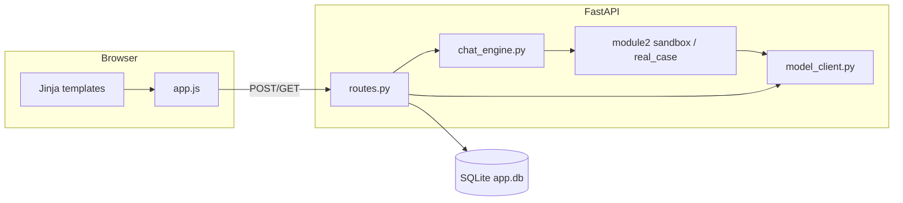

# Covestro Strategy Lab Enterprise — Application Guide

This document summarizes how the app is structured, how data flows, and where to look in the code. Use it alongside `README.md` for setup, environment variables, and run commands.

---

## 1. What this app does

Enterprise **negotiation training** for Module 2:

- Users sign in with **display name**, **CWID**, and **job role**.
- They work in a **workspace** in one of two modes:
  - **DEMO** (`sandbox`) — scripted step-by-step simulation, scenario analysis, optional mentor.
  - **Practice** (`real_case`) — analyzed scenario, then typed negotiation with an AI counterparty; user picks **buyer** or **seller** role.
- **SQLite** stores users, sessions, scenario analysis (context), chat messages, and upload metadata.
- **LLM** usage is optional: scenario analysis can use `no_llm`, `local_model`, or `cloud_model`; chat uses the configured negotiation model.

---

## 2. Tech stack

| Layer | Technology |
|--------|------------|
| Web framework | **FastAPI** (`app.py`) |
| Templates | **Jinja2** (`ui/templates/`) |
| Frontend behavior | **Vanilla JS** (`ui/static/js/app.js`) |
| Styles | `ui/static/css/app.css`, `ui/static/css/workspace-v2.css` |
| Database | **SQLite** (`app.db`, `utils/db.py`) |
| Sessions (browser) | **Starlette** `SessionMiddleware` (signed cookie, not the same as “workspace session”) |
| LLM | `core/model_client.py` — OpenAI and/or AWS Bedrock, with fallbacks |

---

## 3. Repository layout (mental map)

```
app.py                 # FastAPI app, middleware, static mount, DB init on startup
ui/routes.py           # Almost all HTTP routes (pages + JSON APIs)
ui/templates/          # Jinja HTML (workspace, base, index, manager, …)
ui/static/js/app.js    # Workspace UI: analyze, chat stream, DEMO steps, sidebar, …
ui/static/css/         # Global + workspace-v2 styling

utils/db.py            # SQLite: users, sessions, messages, session_context, session_files
utils/security.py      # Session cookie user, require_user, manager checks
utils/ai_output_config.py  # Reads numeric settings from data/config.txt

core/chat_engine.py    # Mode dispatch: prepare_mode_context_v2, run_chat, sandbox simulate-step
core/model_client.py   # LLM calls, scenario generation, negotiation
core/scenario_analyzer_v2.py  # Cloud/local JSON analysis templates
core/scenario_store.py # Library scenarios
core/rag.py            # Upload text extraction + metadata

modules/module2/
  sandbox.py           # DEMO prepare, run, simulate_step (buyer/seller turns)
  real_case.py         # Practice prepare + run
  mentor.py            # Mentor runner (where wired)

data/
  config.txt           # Tunables (temperatures, mentor schedule, demo turns, …)
  prompts/             # Externalized prompt text (skills, rules, …)
```

---

## 4. Architecture (request flow)



- **Pages** are rendered in `ui/routes.py` and return HTML with context (mode, `session_id`, messages, `recent_sessions`, etc.).
- **JSON APIs** are also in `ui/routes.py`; `app.js` calls them with `fetch` (multipart for prepare, JSON/SSE for chat).

---

## 5. Authentication and roles

| Step | Behavior |
|------|----------|
| Login | `POST /auth/start` — creates/updates user in DB, stores user payload in **signed session cookie**. |
| Logout | `GET /logout` clears cookie. |
| Protected routes | `require_user(request)` — must be logged in. |
| Manager UI | `Sales Manager` and `HR` — `/manager` and `/api/manager/analytics`. |

User record (`users`): `id` (UUID), `cwid`, `display_name`, `role`.

---

## 6. Workspace modes (product)

### 6.1 URLs

- **DEMO:** `GET /workspace/sandbox`  
- **Practice:** `GET /workspace/real_case`  
- **Resume / open a saved run:** `GET /workspace/{mode}?session_id={uuid}`  
  - `session_id` is read **only from the query string** in `routes.py` (avoids ambiguity with the word `session_id` in other layers).

### 6.2 DEMO (`sandbox`)

- Scenario sources: AI-generated, **library**, **upload**, **paste**.
- **Analyze scenario** → persists analysis into `session_context` (and creates/links session — see §7).
- **Start DEMO (step-by-step)** / **Next turn** → `POST /api/sandbox/simulate-step` — one model turn per request; transcript + optional mentor.
- **Difficulty** and **Mentor** toggles affect DEMO API payload.
- Composer: DEMO uses toolbar only (no free-text chat in sandbox UI for the main line); Practice uses the textarea.

### 6.3 Practice (`real_case`)

- Sources: **library**, **paste**, **upload**.
- **You play as** buyer or seller — `POST /api/session/practice-role` persists choice on the session.
- After analysis: **Start** opens the thread; **Send** streams assistant reply (SSE).
- **Finish** dialog: keep scenario + clear chat, or full reset — `POST /api/session/finish-negotiation`.

---

## 7. Session lifecycle (important)

**Workspace “session”** = one row in `sessions` + related `messages` / `session_context` / `session_files`.

1. **Open workspace without `?session_id=`**  
   - The server **does not** create a `sessions` row.  
   - The page renders with an **empty** `session_id` in the hidden form field and `data-session` on `#workspace-root`.

2. **First successful Analyze** (`POST /api/scenario/prepare`)  
   - If the form’s `session_id` is empty, the server **creates** a session with a human-friendly default title, runs analysis, upserts `session_context`, renames title from analysis when possible.  
   - Response includes **`session_id`**.  
   - `app.js` updates the hidden field, `data-session`, and uses **`history.replaceState`** so the URL contains `?session_id=...` (refresh keeps the same run).

3. **Subsequent actions** (chat, DEMO step, finish, delete)  
   - Always use the current `session_id`.  
   - All session-scoped APIs verify **`session.user_id` matches the logged-in user** before mutating data.

4. **Delete session**  
   - `POST /api/session/delete` with `{ "session_id": "..." }` — removes messages, files meta, context, then the session row (only if owned by the user).

**Sidebar “History”** lists `recent_sessions` for the **current mode** (`list_recent_sessions_for_user`). New runs appear after the first Analyze (or when opening an existing `session_id`).

---

## 8. Data model (SQLite)

| Table | Purpose |
|-------|---------|
| `users` | Identity and role. |
| `sessions` | One negotiation workspace run: `session_id`, `user_id`, `module_key`, `mode_key`, `title`, timestamps, `practice_role`. |
| `session_context` | One row per session: analyzed scenario JSON + `raw_text`, `source_type`, `source_name`. |
| `messages` | Chat lines: `session_id`, `module_key`, `mode_key`, `role`, `content`, `audit_json`. |
| `session_files` | Upload metadata for a session. |

Messages are filtered by **`mode_key`** when loading the workspace so DEMO and Practice threads for the same UUID do not mix in the UI.

---

## 9. Main HTTP endpoints

### Pages (HTML)

| Method | Path | Notes |
|--------|------|--------|
| GET | `/` | Home |
| POST | `/auth/start` | Login form |
| GET | `/logout` | Logout |
| GET | `/workspace/{mode}` | Workspace; optional `?session_id=` |
| GET | `/manager` | Manager dashboard (role-gated) |

### Workspace APIs (JSON / stream)

| Method | Path | Purpose |
|--------|------|---------|
| POST | `/api/scenario/prepare` | Multipart: analyze scenario; may **create** session; returns `{ ok, context, session_id }`. |
| POST | `/api/chat/stream` | SSE chat / start / help / coach. |
| POST | `/api/sandbox/simulate-step` | One DEMO turn + state. |
| POST | `/api/session/practice-role` | Save buyer/seller. |
| POST | `/api/session/delete` | Delete owned session + related rows. |
| POST | `/api/session/finish-negotiation` | Clear chat and optionally reset context. |
| GET | `/api/session/{session_id}` | Session payload (used where applicable). |
| GET | `/api/manager/analytics` | Manager JSON. |

---

## 10. Scenario analysis pipeline

- **Entry:** `POST /api/scenario/prepare` in `ui/routes.py`.  
- **Logic:** `core/chat_engine.py` → `prepare_mode_context_v2(...)`:
  - `no_llm` → `prepare_mode_context` → `sandbox.prepare_scenario` / `real_case.prepare_scenario` with `use_llm=False`.
  - `cloud_model` + source `ai` → same preparer with `use_llm=True` (scenario generation path).
  - `local_model` → `analyze_with_local_model` (stub / placeholder behavior unless extended).
  - Otherwise → `analyze_with_cloud_model` (JSON-shaped analysis).
- **Persistence:** `upsert_session_context(...)` in `utils/db.py`.  
- **Title:** `_maybe_rename_session_after_analysis` updates `sessions.title` from analysis title when present.

---

## 11. Chat and streaming

- **Entry:** `POST /api/chat/stream` — builds payload (session, mode, message, action, practice_role, difficulty, mentor for Practice).  
- **Engine:** `run_chat` → `sandbox.run` or `real_case.run` with normalized action from `core/agents/supervisor.py`.  
- **Response:** Server-Sent Events (`data: {json}\n` chunks); `app.js` reads the stream and updates the assistant bubble + optional mentor line.

Practice user-turn **audit** may be attached in `routes.py` using `real_case_user_audit` where configured.

---

## 12. Configuration

- **`data/config.txt`** — parsed by `utils/ai_output_config.py` (temperatures, max tokens, mentor cadence, DEMO turn defaults, etc.).  
- **`.env` / environment** — API keys and model IDs (see `README.md`).  
- **`data/prompts/*.txt`** — Loaded via `core/prompt_loader.py` for skills, mentor, and scenario templates.

---

## 13. Frontend highlights (`app.js` + `workspace.html`)

- **Analyze:** `FormData` snapshot **before** disabling form controls (avoids missing `source_type` / `analyzer_mode` and HTTP 422).  
- **Session id:** After first successful prepare, **`applyReturnedSessionId`** syncs DOM + URL.  
- **DEMO:** `fetchSandboxSimulateStep` drives `Start DEMO` / `Next turn`.  
- **Sidebar:** Collapsible session history (ChatGPT-style rail); delete button calls `/api/session/delete`; expand/collapse preference in `localStorage`.  
- **UX:** Stepper, difficulty/mentor chips, loading states, mentor scroll/collapse in CSS.

---

## 14. Security notes (checklist for changes)

- Always enforce **`session["user_id"] == current_user["id"]`** (or string-normalized compare) on any API that accepts `session_id`.  
- **Change `SessionMiddleware` secret** in production (`app.py` currently uses a placeholder).  
- Do not trust client-only IDs without server validation.  
- **Delete** and **finish** must remain owner-scoped.

---

## 15. Tests and legacy

- **`tests/test_sandbox_orchestration.py`** — Sandbox step/orchestration tests (run with `pytest` when installed).  
- **`POST /api/sandbox/simulate`** — Legacy full-run simulation; active UI uses **`simulate-step`**.

---

## 16. Quick “where do I change…?”

| Goal | Primary location |
|------|------------------|
| New API route | `ui/routes.py` |
| DB schema / queries | `utils/db.py` |
| DEMO turn logic / prompts | `modules/module2/sandbox.py`, `core/prompt_loader.py`, `data/config.txt` |
| Practice behavior | `modules/module2/real_case.py`, `core/agents/sales.py` |
| Model routing / keys | `core/model_client.py`, `.env` |
| Workspace layout / copy | `ui/templates/workspace.html`, `ui/static/css/workspace-v2.css` |
| Client behavior | `ui/static/js/app.js` |

---

*Generated as an in-repo guide. For install and env vars, see `README.md`.*
